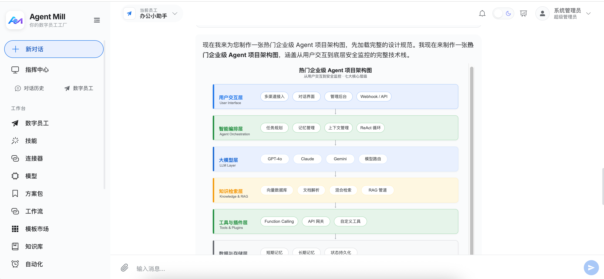

<div align="center">

# 🏭 Agent Mill

### Your Digital Worker Factory — Enterprise AI Agent Platform

[](LICENSE)
[](https://python.org)
[](https://vuejs.org)
[](https://fastapi.tiangolo.com)

English | [中文](README.zh.md)

</div>

---

## What is Agent Mill?

Agent Mill is an **out-of-the-box enterprise AI agent platform**. It allows administrators to configure various AI agents like building blocks, while end users interact with agents through natural language conversations to complete real business tasks such as document processing, data analysis, code generation, and knowledge Q&A.

**In one sentence**: Build an intelligent assistant with tool calling, knowledge retrieval, file processing, and multi-agent collaboration within 10 minutes, then securely deliver it to your team through a web interface.


---

## ⚡ Powered by Claude Agent SDK

Agent Mill is one of the first open-source platforms to integrate **Anthropic's Claude Agent SDK** — the same SDK powering Claude.ai's agentic features. This gives Agent Mill capabilities that most other agent platforms don't have:

| Capability | What It Enables |
|:-----------|:----------------|
| **True SSE Streaming** | Real-time token-by-token streaming with thinking process, tool calls, and results — not simulated polling |
| **Native Tool Use Loop** | Claude's built-in tool orchestration handles skill execution, MCP calls, and file operations without fragile custom loops |
| **Extended Thinking** | Full access to Claude's reasoning process, displayed as collapsible "thinking" cards in the chat UI |
| **Widget Rendering** | Claude can generate interactive SVG charts, HTML forms, and data tables inline — rendered as live iframe widgets |
| **Multi-Turn Autonomy** | Claude autonomously decides when to call tools, when to ask clarifying questions, and when to deliver final answers |
| **Safety Guardrails** | Built-in tool use safety layers — input filtering, output validation, and system prompt integrity |

> For non-Anthropic providers (DeepSeek, Qwen, OpenAI, etc.), Agent Mill implements an equivalent **OpenAI-compatible tool_calls loop** with the same streaming SSE protocol — so all agents share a unified experience regardless of the underlying model.

---

## Problems It Solves

| Enterprise Pain Point | Agent Mill's Solution |
|:----------------------|:----------------------|
| AI models scattered, no unified management | Unified model gateway, manage all LLM providers in one platform |
| Internal knowledge scattered, AI can't retrieve | RAG knowledge base, upload documents for AI to reference |
| Want AI to call internal system APIs | MCP connectors, 3 protocols to connect any tool |
| Need to reconfigure AI every time | Agent templates, configure once and reuse |
| Worried about data security and permission chaos | 3-role RBAC + SSO/LDAP + audit logs |
| Want multiple AIs to collaborate | Multi-agent orchestration (sequential/parallel/MapReduce) |
| Need AI assistant on mobile | Standalone mobile app with full experience |

---

## Core Capabilities

### 🤖 Agent Management

Each agent is an independent AI assistant instance that can:

- Bind different LLM models (Claude, DeepSeek, Qwen, GLM, OpenAI)
- Mount exclusive skills (code execution, file processing, form interaction)
- Connect external tools (database queries, API calls, message push)
- Associate knowledge bases (auto-retrieval injected into context)
- Configure reasoning parameters (model effort level, max turns)

### 🛠️ Skill System (Three Forms)

| Type | Description | Use Case |
|:-----|:------------|:---------|
| **path** | ZIP upload with SKILL.md + resource files | Complex business processes, resource files needed |
| **callable** | Python function direct call | Lightweight tools, rapid development |
| **composite** | YAML DAG step orchestration | Multi-step workflows, conditional branching |

### 🔌 MCP Connector

| Protocol | Description |
|:---------|:------------|
| **stdio** | Subprocess communication |
| **sse** | Server-Sent Events |
| **http** | Streamable HTTP |

### 📚 RAG Knowledge Base

- **Vector Engine**: ZVec (Alibaba, Rust core, embedded — no extra containers)
- **Document Pipeline**: Upload → Parse (30+ formats) → Chunk → Embedding → Index
- **Auto-Injection**: Automatic knowledge retrieval on each conversation turn

### 🔄 Multi-Agent Collaboration

| Orchestration | Description |
|:--------------|:------------|
| **Sequential** | Agent1 → Agent2 → ... → AgentN |
| **Parallel** | All agents process simultaneously |
| **MapReduce** | Individual processing → aggregation |


---

## Quick Start

### Prerequisites

- Python 3.11+
- Node.js 18+
- MySQL 8.0+

### One-Click Setup

```bash
git clone https://github.com/Sugers955/agent-mill.git
cd agent-mill
cp .env.example .env        # Edit DB credentials
make dev                    # Start backend:8000 + frontend:5173
```

Access **http://localhost:5173** — login with `admin` / `Admin@2026`.

### Docker Deployment

```bash
docker compose up -d --build
```

### Management Script

```bash
./mill start      # Start backend + frontend
./mill stop       # Stop all
./mill status     # View running status
./mill logs       # View backend logs
./mill restart    # Restart all
```

---

## Architecture Overview

Agent Mill adopts a frontend-backend separated microservice architecture:

- **Backend**: Python 3.11+ / FastAPI / SQLAlchemy 2.0 (async) / MySQL 8.0
- **Frontend**: Vue 3 / TypeScript / Vite / Pinia / Element Plus
- **Streaming**: Claude Agent SDK (Anthropic) + OpenAI-compatible tool_calls loop
- **Security**: 7-layer protection (input filtering, skill AST scanning, file sandbox, Fernet encryption)
- **Storage**: Local file isolation per user (`storage/uploads/<user_id>/`)

### Streaming Architecture

Agent Mill's dual-path streaming is the core architectural differentiator:

```
┌─ Anthropic Path ─────────────────────────────┐
│  Claude Agent SDK native streaming            │
│  • True SSE with thinking + tool_use events   │
│  • Built-in tool orchestration loop           │
│  • Automatic widget generation                │
└──────────────────────────────────────────────┘

┌─ OpenAI-Compatible Path ─────────────────────┐
│  Custom tool_calls multi-turn loop (max 8)    │
│  • Chat completion streaming                  │
│  • Tool call detection + execution + feedback  │
│  • Unified SSE event protocol                 │
└──────────────────────────────────────────────┘
```

Both paths produce the same SSE event stream (`meta → thinking → text → tool_use → tool_result → file → ui → error → done`), so the frontend renders identically regardless of which provider is used.

---

## Feature Modules (23/23 Complete)

| Module | Status | Description |
|:-------|:------:|:------------|
| Dual-path Streaming | ✅ 100% | Anthropic SDK + OpenAI-compatible |
| Skill System (3 types) | ✅ 100% | path / callable / composite |
| MCP Connector (3 protocols) | ✅ 100% | stdio / sse / http |
| RAG Knowledge Base | ✅ 100% | ZVec + auto-retrieval + 30+ formats |
| DAG Solution Pack | ✅ 100% | 6 node types + human approval |
| Workflow Editor | ✅ 100% | Vue Flow drag-and-drop |
| Template Market | ✅ 100% | 5 templates with next_steps |
| Memory System | ✅ 100% | Extract + dedup + decay + injection |
| Context Compression | ✅ 100% | LLM summarization |
| Self-Learning | ✅ 100% | Scheduled analysis + prompt improvement |
| Multi-Agent Collaboration | ✅ 100% | Communication + auto-consumption + 3 orchestrations |
| RBAC | ✅ 100% | admin / operator / user |
| SSO/LDAP | ✅ 100% | LDAP + OIDC full callback |
| Audit & Compliance | ✅ 100% | Dual-table + masking + approval |
| Data Masking | ✅ 100% | Email / phone / ID card |
| API Rate Limiting | ✅ 100% | Token bucket + path matching |
| Quota Control | ✅ 100% | User-level monthly quota |
| Alert Notifications | ✅ 100% | Rule engine + webhook (DingTalk/WeChat/Feishu) |
| Dashboard | ✅ 100% | 7+3 ECharts charts + CSV export |
| File Processing | ✅ 100% | MinerU + multi-format preview |
| Security (7 layers) | ✅ 100% | From prompt injection to encryption |
| Frontend Refactoring | ✅ 100% | Component-based + dark theme + ARIA |
| Mobile App | ✅ 100% | Independent Vue application |

---

## Screenshots

| Interface | Preview |
|:----------|:--------|
| **Command Center** — agent workstation monitoring |  |
| **Architecture Overview** |  |
| **Chat Interface** |  |

---

## License

[MIT License](LICENSE) — Free to use, modify, and distribute.

## Community

- Submit [Issues](https://github.com/Sugers955/agent-mill/issues) to report problems
- Submit [Pull Requests](https://github.com/Sugers955/agent-mill/pulls) to contribute code
