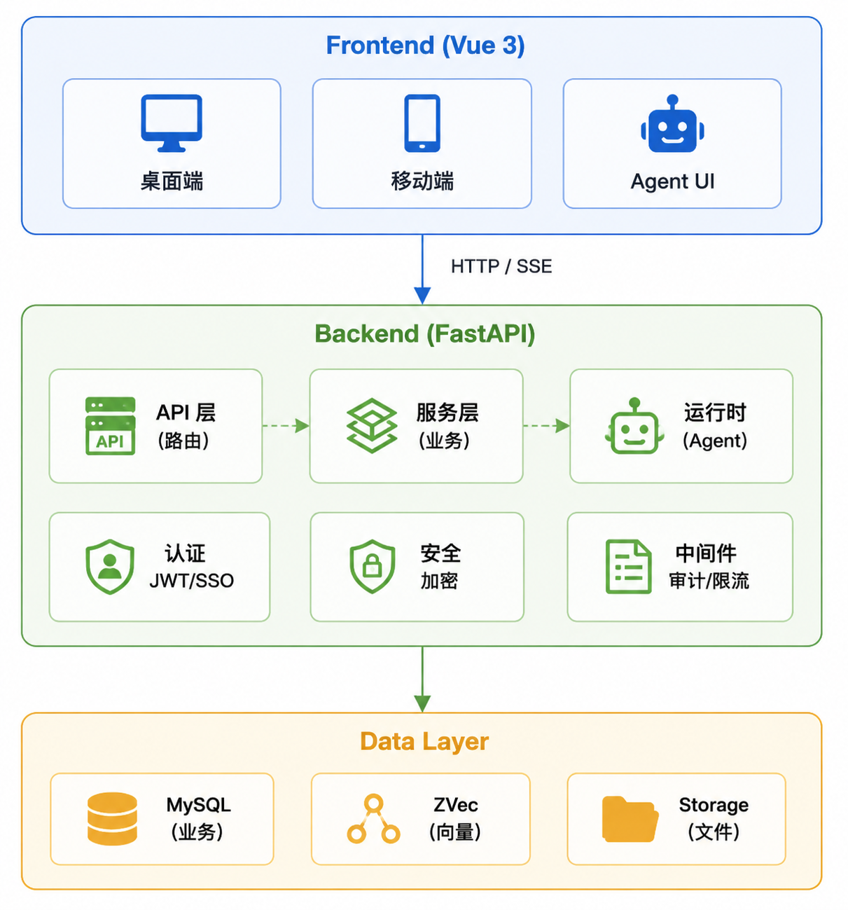

# Architecture

This document describes the overall architecture design, module relationships, and data flow of Agent Mill.

---

## Table of Contents

- [Architecture Overview](#architecture-overview)
- [Tech Stack](#tech-stack)
- [Module Architecture](#module-architecture)
- [Data Flow](#data-flow)
- [Security Architecture](#security-architecture)
- [Deployment Architecture](#deployment-architecture)

---

## Architecture Overview

Agent Mill adopts a frontend-backend separated microservice architecture. Core components include:



*The diagram above shows the overall layered architecture, module relationships, and data flow paths.*

---

## Tech Stack

### Backend

| Component | Technology | Version | Purpose |
|-----------|-----------|---------|---------|
| Web Framework | FastAPI | 0.115+ | API service |
| ORM | SQLAlchemy | 2.0+ | Database operations |
| Database | MySQL | 8.0+ | Business data |
| Authentication | JWT | - | Token authentication |
| Encryption | Fernet | - | API Key encryption |
| AI SDK | Claude Agent SDK | - | Anthropic models |
| AI SDK | OpenAI Python SDK | - | OpenAI compatible models |
| Vector Store | ZVec | - | Vector search |

### Frontend

| Component | Technology | Version | Purpose |
|-----------|-----------|---------|---------|
| Framework | Vue | 3.4+ | UI rendering |
| Language | TypeScript | 5.0+ | Type safety |
| Build Tool | Vite | 5.0+ | Dev/build |
| State Management | Pinia | 2.0+ | State management |
| UI Library | Element Plus | 2.0+ | Component library |
| Charts | ECharts | 5.0+ | Data visualization |
| Canvas | Vue Flow | - | Workflow editing |

### Deployment

| Component | Technology | Version | Purpose |
|-----------|-----------|---------|---------|
| Container | Docker | 24.0+ | Application containerization |
| Orchestration | Docker Compose | v2.20+ | Service orchestration |
| Proxy | Nginx | - | Reverse proxy (optional) |

---

## Module Architecture

### Backend Modules

```
backend/app/
├── api/                    # API routing layer
│   ├── admin.py           # Admin endpoints
│   ├── chat.py            # Conversation endpoints
│   └── command_center.py  # Command center endpoints
├── auth/                   # Authentication module
│   ├── jwt.py             # JWT handling
│   ├── sso.py             # SSO/LDAP
│   └── permissions.py     # Permission control
├── core/                   # Core configuration
│   ├── config.py          # Configuration management
│   ├── security.py        # Security utilities
│   └── encryption.py      # Encryption utilities
├── db/                     # Data layer
│   ├── models.py          # SQLAlchemy models
│   ├── init_db.py         # Database migrations
│   └── seed.py            # Seed data
├── runtime/                # Agent runtime
│   ├── agent_runner.py    # Agent executor
│   ├── pack_engine.py     # Solution pack engine
│   └── workflow_engine.py # Workflow engine
├── services/               # Business services
│   ├── rag.py             # RAG service
│   ├── memory.py          # Memory system
│   ├── learning.py        # Self-learning
│   └── alert.py           # Alert service
└── main.py                 # Application entry point
```

### Frontend Modules

```
frontend/src/
├── views/                  # Page components
│   ├── admin/             # Admin pages
│   ├── chat/              # Conversation page
│   ├── command/           # Command center
│   └── tasks/             # Task management
├── components/             # Shared components
│   ├── layout/            # Layout components
│   ├── chat/              # Conversation components
│   └── common/            # Common components
├── mobile/                 # Mobile app
│   ├── views/             # Mobile pages
│   ├── components/        # Mobile components
│   └── stores/            # Mobile state
├── shared/                 # Shared modules
│   ├── constants/         # Constant definitions
│   └── utils/             # Utility functions
└── stores/                 # Pinia state
    ├── auth.ts            # Authentication state
    ├── agents.ts          # Agent state
    └── chat.ts            # Conversation state
```

---

## Data Flow

### Conversation Streaming Response

```
User Input
    │
    ▼
┌─────────────────┐
│   API Gateway   │
│   (Auth/Rate)   │
└────────┬────────┘
         │
         ▼
┌─────────────────┐
│   Chat Service  │
│   (Create Conv) │
└────────┬────────┘
         │
         ▼
┌─────────────────┐
│  Agent Runner   │
│  (Execute)      │
└────────┬────────┘
         │
    ┌────┴────┐
    │         │
    ▼         ▼
┌────────┐ ┌────────┐
│Anthropic│ │OpenAI  │
│ SDK    │ │Compat  │
└────┬───┘ └────┬───┘
     │          │
     └────┬─────┘
          │
          ▼
┌─────────────────┐
│   SSE Stream    │
│   (Event Push)  │
└────────┬────────┘
         │
         ▼
┌─────────────────┐
│  Client Render  │
│  (Markdown/Tool)│
└─────────────────┘
```

### Skill Execution Flow

```
Agent Invokes Skill
    │
    ▼
┌─────────────────┐
│  Skill Router   │
│  (Determine)    │
└────────┬────────┘
         │
    ┌────┴────┐
    │         │
    ▼         ▼
┌────────┐ ┌────────┐
│ path   │ │callable│
│  type  │ │  type  │
└────┬───┘ └────┬───┘
     │          │
     ▼          ▼
┌────────┐ ┌────────┐
│ ZIP    │ │Python  │
│ Extract│ │ import │
│ Execute│ │ Invoke │
└────┬───┘ └────┬───┘
     │          │
     └────┬─────┘
          │
          ▼
┌─────────────────┐
│  Return Result  │
└─────────────────┘
```

### RAG Knowledge Retrieval Flow

```
User Message
    │
    ▼
┌─────────────────┐
│  RAG Service    │
│  (Retrieve KB)  │
└────────┬────────┘
         │
         ▼
┌─────────────────┐
│  ZVec Query     │
│  (Vector Search)│
└────────┬────────┘
         │
         ▼
┌─────────────────┐
│  Result Agg.    │
│  (top_k + thresh)│
└────────┬────────┘
         │
         ▼
┌─────────────────┐
│  Inject Prompt  │
│  (System Prompt)│
└────────┬────────┘
         │
         ▼
┌─────────────────┐
│  Agent Process  │
│  (With Context) │
└─────────────────┘
```

---

## Security Architecture

### 7-Layer Protection

```
┌─────────────────────────────────────────┐
│  Layer 7: API Key Encryption (Fernet)   │
├─────────────────────────────────────────┤
│  Layer 6: Download Token (One-time)     │
├─────────────────────────────────────────┤
│  Layer 5: File Sandbox (cwd restriction)│
├─────────────────────────────────────────┤
│  Layer 4: Skill Scanning (AST analysis) │
├─────────────────────────────────────────┤
│  Layer 3: Input Filtering (12 regex)    │
├─────────────────────────────────────────┤
│  Layer 2: Security Prefix (system prompt│
├─────────────────────────────────────────┤
│  Layer 1: Tool Whitelist (runtime)      │
└─────────────────────────────────────────┘
```

### Authentication Flow

```
User Login
    │
    ▼
┌─────────────────┐
│  Verify Creds   │
│  (Pass/SSO/LDAP)│
└────────┬────────┘
         │
         ▼
┌─────────────────┐
│  Generate Token │
│  (JWT dual)     │
└────────┬────────┘
         │
         ▼
┌─────────────────┐
│  Return Client  │
│  (access+refresh)│
└────────┬────────┘
         │
    ┌────┴────┐
    │         │
    ▼         ▼
┌────────┐ ┌────────┐
│API Req │ │Token   │
│        │ │Refresh │
└────┬───┘ └────┬───┘
     │          │
     ▼          ▼
┌────────┐ ┌────────┐
│Verify  │ │Generate│
│Expiry  │ │New Tk  │
└────┬───┘ └────┬───┘
     │          │
     └────┬─────┘
          │
          ▼
┌─────────────────┐
│  Continue Req   │
└─────────────────┘
```

---

## Deployment Architecture

### Docker Compose Architecture

```
┌─────────────────────────────────────────────────┐
│                 Docker Network                   │
│                                                  │
│  ┌──────────┐  ┌──────────┐  ┌──────────┐      │
│  │   web    │  │   api    │  │  mysql   │      │
│  │ (Nginx)  │  │(FastAPI) │  │ (MySQL)  │      │
│  │  :80     │  │  :8000   │  │  :3306   │      │
│  └──────────┘  └──────────┘  └──────────┘      │
│       │              │              │           │
│       └──────────────┴──────────────┘           │
│                      │                           │
└──────────────────────┼───────────────────────────┘
                       │
                  ┌────┴────┐
                  │  Host   │
                  │         │
                  └─────────┘
```

### Data Persistence

```
./storage/
├── uploads/               # User uploaded files
│   └── <user_id>/
├── outputs/               # Agent generated files
│   └── <user_id>/
└── skills/                # Skill resource files
    └── <skill_code>/
```

---

## Extension Points

### Adding a New LLM Provider

1. Add provider detection in `agent_runner.py`
2. Implement corresponding API call logic
3. Register new provider type in `models.py`
4. Update frontend model configuration page

### Adding a New Skill Type

1. Add type detection in `skill_executor.py`
2. Implement corresponding execution logic
3. Register new skill type in `models.py`
4. Update frontend skill management page

### Adding a New MCP Transport Protocol

1. Add protocol support in `mcp_client.py`
2. Implement corresponding connection and communication logic
3. Register new protocol type in `models.py`
4. Update frontend connector configuration page

---

## Related Documentation

- [Project Overview](PROJECT_OVERVIEW.md) — Complete feature documentation
- [Frontend Design Guide](frontend-design-guide.md) — UI/UX development guide
- [Deployment Guide](DEPLOYMENT.md) — Docker and production setup
- [API Reference](API.md) — REST endpoint reference
