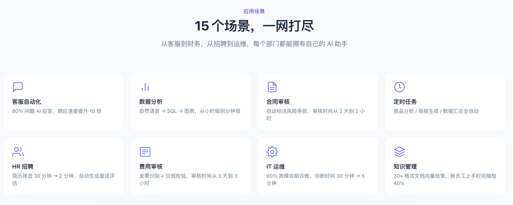
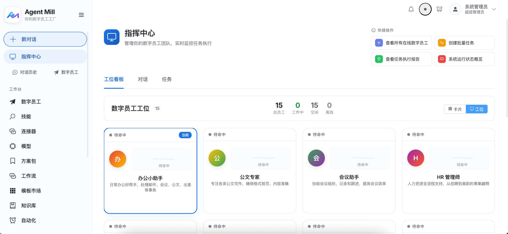

# Project Capabilities

> Your Digital Workforce Factory — Enterprise Digital Workforce Platform
> Database Tables: 40 | 23 Feature Modules

---

## 1. Project Overview

Agent Mill is an **enterprise digital workforce platform** whose core objective is to enable administrators to quickly configure various AI digital workforces, and end users to interact with them through a conversation interface, achieving capabilities such as tool invocation, file processing, knowledge retrieval, and multi-agent collaboration.



**Tech Stack**:
- Backend: Python 3.11+ / FastAPI / SQLAlchemy 2.0 (async) / MySQL 8.0 / Claude Agent SDK / OpenAI SDK
- Frontend: Vue 3 / TypeScript / Vite / Pinia / Element Plus
- Vector Search: ZVec (Alibaba, Rust core, embedded)
- Deployment: Docker Compose (api + web) + local MySQL

---

## 2. User System & Permissions

### 2.1 Three-Role RBAC

| Role | Permission Scope |
|------|-----------------|
| **admin** | Full permissions: user/role/department management + digital workforces/skills/connectors/model config + logs + conversations |
| **operator** | Configuration permissions: skills/connectors/digital workforces/model config + logs + conversations, **cannot manage users/roles/departments** |
| **user** | Conversation only; visible digital workforces controlled by `role_agent_grants` |

### 2.2 Authentication

- Local username/password login (bcrypt hashing)
- JWT dual token: access token (12 hours) + refresh token (2 days)
- SSO/LDAP: LDAP authentication fallback + OIDC callback flow (state-based CSRF prevention)
- 48-hour idle auto-logout

### 2.3 Department Management

- Tree-structured departments (parent_id self-reference)
- Circular dependency detection, force deletion

---

## 3. Digital Workforce System

### 3.1 Configuration

Each digital workforce contains:
- **Basic Info**: name, description, icon, system_prompt
- **Model Config**: primary model + fallback model (auto-switch)
- **Capability Mounting**: skills (many-to-many) + connectors (many-to-many) + solution packs (many-to-many)
- **Knowledge Base**: linked ZVec knowledge base, auto-retrieval injection during conversation
- **Upload Policy**: extension whitelist, size limits, parsing mode
- **Inference Params**: max_turns, effort (low/medium/high/xhigh/max)
- **Role Visibility**: controlled via role_agent_grants

### 3.2 Template Marketplace

5 preset multi-agent collaboration templates, one-click deployment:

| Template | Scenario |
|----------|----------|
| hr-support | HR intelligent assistant (onboarding/attendance/leave) |
| customer-service | Customer service center (inquiry/tickets/complaints) |
| marketing | Marketing campaign (planning/copywriting/data analysis) |
| onboarding | Employee onboarding (process/training/documentation) |
| software-dev | Software development team (requirements/code/testing) |

After template deployment, returns `next_steps` action guide (configure skills/connectors/knowledge base).

---

## 4. Model Management

### 4.1 Supported Providers

| Provider | Provider ID | Protocol |
|----------|------------|----------|
| Anthropic (Claude) | `anthropic` | Claude Agent SDK |
| DeepSeek | `deepseek` | OpenAI compatible |
| Tongyi Qianwen (Qwen) | `qwen` | OpenAI compatible |
| Zhipu (GLM) | `glm` | OpenAI compatible |
| OpenAI | `openai` | OpenAI compatible |
| Any compatible | `openai-compatible` | OpenAI compatible |

### 4.2 Model Configuration

- API Key Fernet encrypted storage; frontend only shows `has_api_key`
- One-click connectivity test
- extra_params_json passthrough (e.g., `enable_thinking`)

---

## 5. Skill System

### 5.1 Three Skill Types

| Type | Form | Execution |
|------|------|-----------|
| **path** | ZIP upload → SKILL.md + resources | File-level loading + Python script execution |
| **callable** | `module.path:func` | Direct import invocation (admin only) |
| **composite** | YAML DAG step orchestration | DAGExecutor topological layering + parallel |

### 5.2 Security Scanning

- Shell injection pattern detection (9 rules)
- Python AST static analysis (forbids eval/exec/subprocess, etc.)
- Upload interception + audit logging

### 5.3 Built-in Tools

| Tool | Function |
|------|----------|
| `save_output_file` | Save generated files |
| `_read_skill_file` | Read skill resources |
| `run_skill_script` | Execute Python scripts |
| `ask_user_pick` | Show option card |
| `ask_user_form` | Show form |
| `run_pack__<code>` | Execute solution pack |

---

## 6. MCP Connector System

### 6.1 Three Transport Protocols

| Protocol | Description |
|----------|-------------|
| **stdio** | Subprocess mode |
| **sse** | Server-Sent Events |
| **http** | Streamable HTTP |

### 6.2 Management

- CRUD + connection test + tool list retrieval
- LLM auto-generated Chinese summary
- Per-digital-workforce isolated mounting
- Whitelist + parameter injection detection

---

## 7. RAG Knowledge Base

### 7.1 Vector Retrieval

- **ZVec**: Alibaba Rust core, embedded (pip install), zero new containers
- **Embedding**: OpenAI compatible API (text-embedding-3-small), error prompt if not configured
- **Chunking**: 500 character window + 50 overlap
- **Search**: Cosine similarity, configurable top_k

### 7.2 Document Pipeline

Upload → Parse (30+ formats) → Chunk → Embedding → ZVec index

### 7.3 Agent Binding

- Select knowledge base in agent configuration
- Auto-retrieve knowledge base for each conversation, inject into system prompt
- Last user message as query, top_k=3

### 7.4 Frontend Management

- Knowledge base list + create + delete (requires approval)
- Document management + upload + source file preview (JWT auth)
- Search testing

---

## 8. Solution Pack System

### 8.1 Core Capabilities

Declarative DAG business process runtime:
- Persistence: write to database after each node execution
- Recoverable: checkpoint recovery
- Human approval: pause and wait for approval before continuing
- Sub digital workforce: delegate to another agent for execution
- Execution tracing: complete trace records

### 8.2 Six Node Types

| Node | Function |
|------|----------|
| **skill** | Invoke skill execution |
| **parallel_group** | Parallel group (all_success/first_success/n_of_m) |
| **aggregator** | Aggregator |
| **condition** | Conditional branch (rule/LLM judgment) |
| **sub_agent** | Sub-agent delegation |
| **human_approval** | Human approval |

### 8.3 Visual Workflow Editor

- Vue Flow canvas, drag-and-drop orchestration
- 6 node types, connections define dependencies
- Compile to solution pack YAML → reuse PackEngine
- **Run Now** button + async execution + status polling + history

---

## 9. Conversation & Streaming System

### 9.1 Dual-Path Streaming

| Path | Condition | Implementation |
|------|-----------|----------------|
| **Anthropic** | provider == "anthropic" | Claude Agent SDK true streaming |
| **OpenAI compatible** | Other providers | `/v1/chat/completions` stream + tool_calls multi-round (max 8 rounds) |

### 9.2 SSE Event Types

`meta` → `thinking` → `text` → `tool_use` → `tool_result` → `file` → `ui` → `error` → `done`

### 9.3 Intelligent Enhancements

- **Memory System**: Auto-extract preferences/facts at conversation end, inject into prompt, dedup + 90-day decay
- **Context Compression**: Auto-summarize when exceeding 30 messages, retain last 10
- **Self-learning**: Hourly feedback analysis, auto-generate prompt improvement suggestions for low-satisfaction agents
- **Conversation Branching**: Create branched conversations from any message
- **Message Edit & Resend**: Edit → truncate → regenerate
- **Streaming Markdown**: Auto-complete unclosed code blocks

---

## 10. File Processing System

### 10.1 File Parsing

| Format | Method |
|--------|--------|
| TXT/MD/CSV/JSON/HTML/XML/YAML | Direct read |
| PDF | MinerU → fallback pypdf |
| DOCX | MinerU → fallback python-docx |
| XLSX | MinerU → fallback openpyxl |
| Images | MinerU OCR |

### 10.2 File Preview

- HTML iframe / PDF native / Markdown / text code block / SVG / images
- Word/PPT/Excel download only
- Security: one-time token / 24h expiry / user_id verification

---

## 11. Enterprise Features (All Complete)

### 11.1 Audit Compliance

- **Dual-table audit**: `audit_logs` (admin operations) + `call_logs` (conversation calls)
- **Audit log masking**: Auto-mask email/phone
- **Operation approval**: High-risk operations (delete digital workforce/skill/knowledge base/model) require approval
- **Admin notification**: Auto-notify other admins when creating approvals

### 11.2 Data Masking

- `mask_email`: t***t@example.com
- `mask_phone`: 138****5678
- `mask_id_card`: 1101**********1234
- Configuration persisted to SystemConfig table
- Auto-mask on audit log retrieval

### 11.3 API Rate Limiting

- Token bucket algorithm, path matching
- Default 5 req/min, return 429 + Retry-After on exceed
- Whitelist paths: /health, /docs, /openapi.json

### 11.4 Quota Control

- User-level monthly quota
- Alert threshold notifications

### 11.5 SSO/LDAP

- **LDAP**: ldap3 library, bind search → password verification → group query, async non-blocking
- **OIDC**: Complete callback flow (auth URL → code-to-token → get user info → role mapping → JWT)
- **State verification**: CSRF prevention, in-memory storage + 10-minute expiry

### 11.6 Alert Notifications

- **Rule Engine**: 4 metric types (token/error_rate/call_count/latency) + 4 conditions
- **Notification Channels**: In-app + DingTalk/WeCom/Feishu Webhook
- **Connectivity Test**: One-click Webhook config test
- **Scheduled Evaluation**: Auto-evaluate rules every minute

---

## 12. Observability

### 12.1 Dashboard

7+3 ECharts charts:
- Overview stats (calls/users/token consumption/success rate)
- Distribution by user/digital workforce/model
- Trend charts (7/30 days)
- Latency trend / error rate trend / system health

### 12.2 Token Consumption Details

- Paginated query + filtering (user/digital workforce/model/time)
- CSV export

### 12.3 Log Management

- Audit logs + call logs dual tabs
- Filter by user/digital workforce
- Detail JSON expansion

---

## 13. Multi-Agent Collaboration

### 13.1 Inter-Agent Communication

- Message send/receive/complete/reply
- Priority (normal/high priority)
- Task delegation

### 13.2 Automatic Message Consumption

- Singleton polling pending messages (every 5 seconds)
- Auto-invoke target agent for processing
- Independent DB session per operation, no connection leaks

### 13.3 Orchestration Scheduler

| Workflow | Description |
|----------|-------------|
| **sequential** | Sequential: Agent1 → Agent2 → ... → AgentN |
| **parallel** | Parallel: All agents process simultaneously |
| **map_reduce** | Individual processing → aggregation |

---

## 14. Security (7-Layer Protection)

| Layer | Mechanism |
|-------|-----------|
| 1 | Tool whitelist (runtime) |
| 2 | System prompt security prefix (model layer) |
| 3 | Input regex filtering (gateway layer, 12 rules) |
| 4 | Skill static scanning (upload time) |
| 5 | File cwd sandbox (SDK layer) |
| 6 | Download token (egress layer) |
| 7 | API Key encryption (Fernet) |

---

## 15. Frontend Capabilities

### 15.1 Page Architecture



*Command Center interface: real-time view of digital workforce status, start conversations, manage tasks.*

| Page | Function |
|------|----------|
| Login | Glassmorphism login |
| Layout | Collapsible sidebar + theme switching |
| Chat | Core conversation (547 lines after component refactoring) |
| CommandCenter | User command center |
| Dashboard | Statistics panel |
| Models | Model management |
| Skills | Skill management |
| MCP | Connector management |
| Agents | Digital workforce management |
| KnowledgeBases | Knowledge base management |
| KnowledgeBaseDetail | Document management + upload + search |
| AgentTemplates | Template marketplace |
| WorkflowList | Workflow list |
| WorkflowEditor | Vue Flow canvas editor |
| Approvals | Solution approval + operation approval |
| Logs | Audit logs + call logs |
| Users/Roles/Departments | User management |

### 15.2 Conversation Components

- **WelcomePanel**: Welcome page + digital workforce cards
- **MessageList**: Message list (ARIA: role=log)
- **ComposerInput**: Input area + slash menu
- **StepCard**: Tool step card

### 15.3 User Experience

- Dark theme (CSS variable switching + localStorage)
- Responsive layout (768px mobile adaptation)
- ARIA accessibility (role/aria-label/tabindex)
- Shortcut commands (/ slash menu)

### 15.4 Mobile

Independent Vue app `/m.html`, Hash routing, completely independent routes/stores/views/styles.

---

## 16. Database

### 16.1 38 Tables

| Table | Purpose |
|-------|---------|
| roles | RBAC roles |
| users | User accounts |
| departments | Department tree |
| models | LLM model configuration |
| mcp_connectors | MCP connectors |
| skills | Skill definitions |
| agents | Digital workforce configuration |
| agent_skills / agent_mcps / agent_packs | Many-to-many associations |
| agent_knowledge_bases | Digital workforce-knowledge base association |
| role_agent_grants | Role-digital workforce visibility |
| conversations / messages | Conversations and messages |
| uploaded_files / download_tokens | Files and download tokens |
| knowledge_bases / kb_documents / kb_chunks | Knowledge bases |
| agent_templates | Template marketplace |
| workflow_definitions / workflow_runs | Workflows |
| solution_packs / pack_runs / pack_approvals | Solution packs |
| tasks / task_runs | Scheduled tasks |
| notifications / favorites | Notifications and favorites |
| audit_logs / call_logs | Audit and call logs |
| operation_approvals | Operation approvals |
| alert_rules / alert_events | Alerts |
| message_feedback / agent_learning | Self-learning |
| agent_memories | Memory system |
| system_config | System config (masking/webhooks, etc.) |
| agent_messages | Inter-agent communication |

### 16.2 Migration Strategy

- Auto-execute on startup: `CREATE TABLE IF NOT EXISTS` + `ALTER TABLE ADD COLUMN IF NOT EXISTS`
- MySQL 8.0.23 compatible (use information_schema fallback for unsupported syntax)
- All tables and fields must have English COMMENT

---

## 17. Deployment

### 17.1 Docker Compose

```bash
cp .env.example .env
make deploy          # First deployment
make deploy-update   # Incremental update
make deploy-status   # Check status
make deploy-down     # Stop
```

### 17.2 Local Development

```bash
make dev             # Backend:8000 + Frontend:5173
make stop            # Stop
make logs            # View logs
make build           # Frontend build
make typecheck       # TypeScript check
```

### 17.3 Docker Deployment

```bash
# First deployment
docker compose up -d

# Check status
docker compose ps

# View logs
docker compose logs -f api
```

---

## 18. Feature Completion

| Module | Status | Description |
|:-------|:------:|:------------|
| Core Engine (Dual-Path Streaming) | ✅ 100% | Anthropic SDK + OpenAI compatible |
| Skill System (Three-State) | ✅ 100% | path/callable/composite |
| MCP Connector (Three-Protocol) | ✅ 100% | stdio/sse/http |
| RAG Knowledge Base | ✅ 100% | ZVec + auto-retrieval injection + 30+ formats |
| Solution Pack (DAG Execution) | ✅ 100% | 6 node types + human approval |
| Visual Workflow | ✅ 100% | Vue Flow canvas + run now + status polling |
| Template Marketplace | ✅ 100% | 5 templates + full config + next_steps |
| Memory System | ✅ 100% | Extraction + dedup + decay + injection |
| Context Compression | ✅ 100% | LLM summarization |
| Self-learning | ✅ 100% | Scheduled analysis + prompt improvement suggestions |
| Multi-Agent Collaboration | ✅ 100% | Communication + auto-consumption + three orchestration modes |
| RBAC | ✅ 100% | admin/operator/user |
| SSO/LDAP | ✅ 100% | LDAP + OIDC complete callback |
| Audit Compliance | ✅ 100% | Dual-table + masking + operation approval |
| Data Masking | ✅ 100% | Persistence + email/phone/id_card |
| API Rate Limiting | ✅ 100% | Token bucket + path matching |
| Quota Control | ✅ 100% | User-level monthly quota |
| Alert Notifications | ✅ 100% | Rule engine + in-app/DingTalk/WeCom/Feishu |
| Dashboard | ✅ 100% | 7+3 charts + CSV export |
| File Processing | ✅ 100% | MinerU + multi-format preview |
| Security System | ✅ 100% | 7-layer protection |
| Frontend Refactoring | ✅ 100% | Componentized + dark theme + ARIA |
| Mobile | ✅ 100% | Independent Vue app |

**All 23 modules fully implemented and operational.**

---

## 19. Future Expansion

| Direction | Priority | Description |
|-----------|----------|-------------|
| Embedded Chat Widget | 🔥🔥🔥 | JS snippet for third-party websites |
| Multi-language i18n | 🔥🔥🔥 | English/Japanese interfaces |
| Public API Gateway | 🔥🔥🔥 | REST API + Key auth + billing |
| Multi-tenant SaaS | 🔥🔥🔥 | Organization isolation + self-service registration |
| Voice/Multimodal | 🔥🔥 | Voice I/O + image understanding |
| Agent Debugger | 🔥🔥 | IDE-style step execution + breakpoints |
| Cost Optimization Engine | 🔥🔥 | Intelligent model routing + budget |
